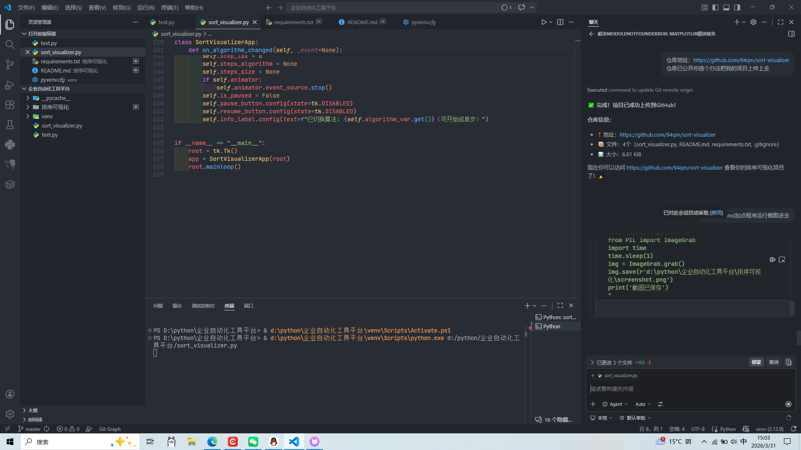

# 排序可视化

交互式排序算法教学工具，通过实时可视化展演来帮助理解排序算法原理。

## 功能特性

- **4种排序算法**：冒泡排序、选择排序、插入排序、快速排序
- **交互式控制**：开始/暂停/恢复/单步执行/重置
- **实时教学**：
  - 显示数组状态表（下标 + 数值）
  - 标记比较/扫描的索引位置
  - 逐步呈现算法执行过程
- **视觉反馈**：
  - 柱状图表示数据
  - 颜色编码（比较中=青色、已排序=绿色、未排序=红色）
  - 数字标签显示数值
- **可调节参数**：数组大小、动画速度

## 使用方法

```bash
python sort_visualizer.py
```

### 操作步骤

1. **选择算法**：从下拉菜单选择排序算法
2. **设置参数**：
   - 数组大小（5-50）
   - 动画速度
3. **执行演示**：
   - 点击"开始"进行自动演示
   - 或点击"单步"逐步执行
   - 点击"暂停"暂停动画
   - 点击"恢复"继续执行

## 程序界面



**界面说明：**
- 左侧：柱状图展示当前数组状态
  - 青色柱：正在比较的元素
  - 绿色柱：已排好序的元素
  - 红色柱：未排序的元素
  - 黄色标签：标记各排序算法的关键索引位置
- 右侧上方：算法说明和实时过程日志
- 右侧下方：数组状态表（显示下标和对应数值）
- 下方：控制面板（选择算法、调节参数、控制执行）

## 技术栈

- **Python 3.13**
- **Tkinter**：GUI框架
- **Matplotlib**：数据可视化
- **NumPy**：数值计算

## 依赖安装

```bash
pip install -r requirements.txt
```

## 项目结构

```
排序可视化/
├── sort_visualizer.py    # 主程序
├── requirements.txt      # 依赖列表
└── README.md            # 项目说明
```

## 算法复杂度

| 算法 | 时间复杂度（平均） | 时间复杂度（最坏） | 空间复杂度 |
|------|------------------|-----------------|----------|
| 冒泡排序 | O(n²) | O(n²) | O(1) |
| 选择排序 | O(n²) | O(n²) | O(1) |
| 插入排序 | O(n²) | O(n²) | O(1) |
| 快速排序 | O(n log n) | O(n²) | O(log n) |

## 许可证

MIT
